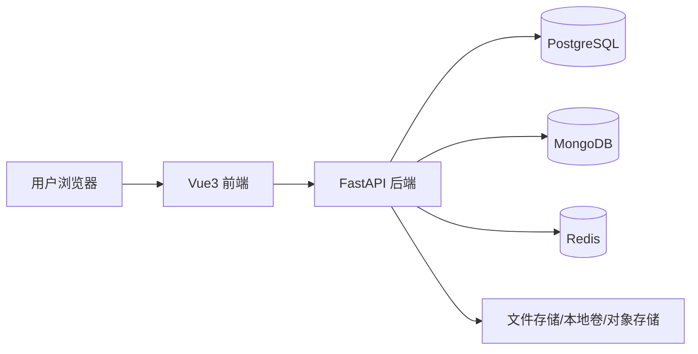
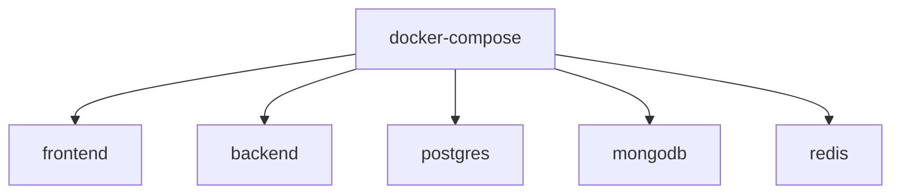

# 系统架构文档

## 1. 架构目标

系统架构设计目标如下：

- 支持项目管理全流程
- 支持多层级任务拆分
- 支持附件、文档、评论、动态记录
- 支持透明化看板和统计分析
- 支持容器化部署
- 支持后续扩展为多环境部署

## 2. 总体架构

建议采用前后端分离 + 多存储协同架构。



## 3. 技术栈

### 3.1 前端

- Vue3
- Vue Router
- Pinia
- Element Plus
- Axios
- ECharts

### 3.2 后端

- Python 3.12+
- FastAPI
- SQLAlchemy / SQLModel
- Pydantic
- Alembic
- Uvicorn / Gunicorn

### 3.3 数据存储

#### PostgreSQL

用于存储强结构化核心业务数据：

- 用户
- 部门
- 项目
- 需求
- 主任务
- 子任务
- 技术线子任务
- 缺陷
- 测试计划
- 版本
- 工时
- 操作记录

#### MongoDB

按当前项目要求使用 MongoDB 承载以下类型的数据：

- 富文本说明
- 任务扩展信息
- 动态表单结构
- 文档元数据
- 评论内容
- 页面草稿类配置
- 复杂嵌套结构的过程快照

说明：

- MongoDB 并非传统图数据库
- 当前按你的要求纳入架构中，主要承担文档型和扩展型数据存储
- 若未来需要真正图关系分析，再评估专门图数据库

#### Redis

Redis 建议使用，但不是第一阶段必须依赖核心业务才能运行。

建议用途：

- 登录态缓存
- 验证码
- 热点查询缓存
- 消息通知缓冲
- 限流
- 异步任务辅助

## 4. 模块架构

后端模块建议如下：

- `auth`
- `user`
- `organization`
- `project`
- `requirement`
- `task`
- `sprint`
- `test`
- `bug`
- `release`
- `timesheet`
- `okr`
- `document`
- `notification`
- `report`
- `system`

## 5. 数据分层建议

### 核心业务层

存 PostgreSQL：

- 项目
- 需求
- 任务
- 人员
- 工时
- 缺陷
- 版本

### 扩展内容层

存 MongoDB：

- 任务详细说明
- 富文本过程记录
- 评论正文
- 附件元数据扩展
- 页面配置与动态结构

### 缓存与加速层

存 Redis：

- 短期缓存
- 会话数据
- 排队消息
- 验证码

## 6. 附件与文件架构

附件本体建议不要直接存数据库，建议如下：

- 文件本体：存本地挂载卷或对象存储
- 文件元数据：存 PostgreSQL 或 MongoDB

建议区分：

- 原型图
- 设计稿
- 图片截图
- 文档附件
- 压缩包
- 发布资料

## 7. Docker Compose 部署架构

推荐使用以下容器：



### 7.1 推荐服务清单

- `frontend`
  - Vue3 前端服务
- `backend`
  - FastAPI 后端服务
- `postgres`
  - 关系数据库
- `mongodb`
  - 文档数据库
- `redis`
  - 缓存服务

### 7.2 后续可选服务

- `nginx`
- `celery_worker`
- `celery_beat`

## 8. 运行环境建议

### 本地开发环境

- 前端可独立启动，也可容器启动
- 后端建议容器启动
- PostgreSQL / MongoDB / Redis 用 Compose 启动

### 测试环境

- 全量容器化
- 固定测试数据
- 开启日志与监控

### 生产环境

- 建议拆分 Compose 或迁移到更规范的容器编排方案
- 配置反向代理
- 配置数据备份

## 9. 安全与稳定性建议

- PostgreSQL 定期备份
- MongoDB 定期备份
- Redis 配置持久化策略
- 接口层统一鉴权
- 上传文件限制类型和大小
- 日志分类管理
- 关键操作记录留痕

## 10. 推荐目录结构

```text
ProjectTrace/
├─ docs/
├─ backend/
├─ frontend/
├─ deploy/
│  ├─ docker-compose.yml
│  ├─ .env.example
│  └─ nginx/
├─ scripts/
├─ PageDesign/
├─ 项目管理平台需求文档.md
└─ 详细流程业务流程设计.md
```

## 11. 架构演进建议

第一阶段：

- 单体后端 + 单前端 + PostgreSQL + MongoDB + Redis

第二阶段：

- 增加异步任务
- 增加日志监控
- 增加对象存储

第三阶段：

- 增加全文检索
- 增加消息中心增强
- 增加 BI 分析能力
