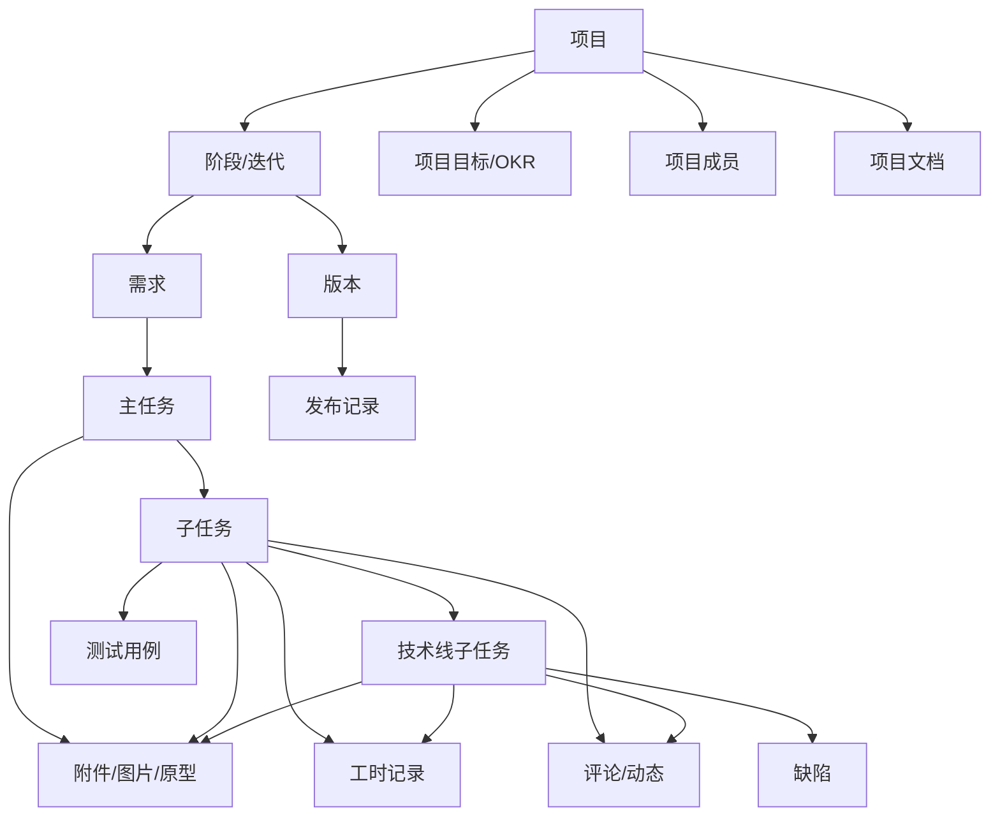
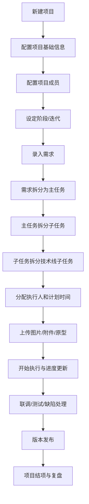
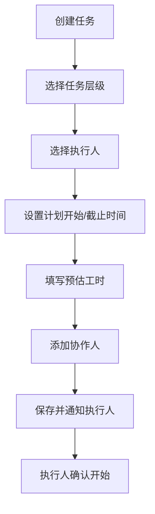
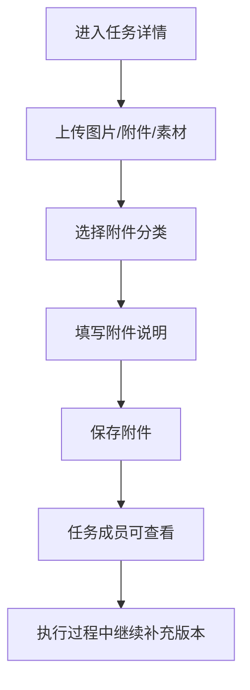
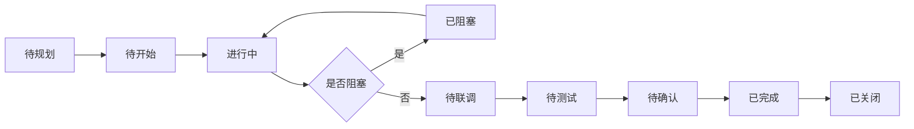
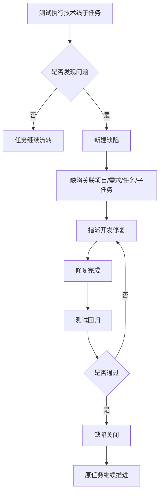
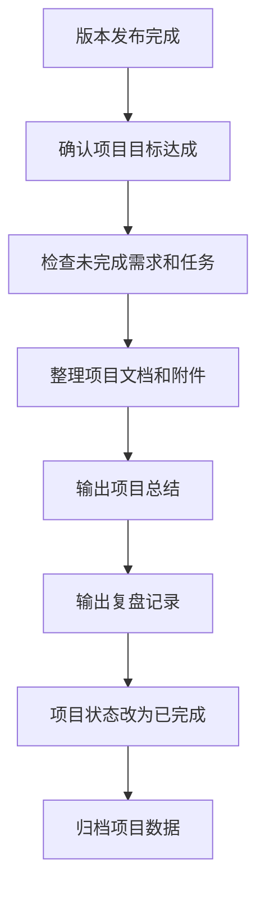

# 项目管理平台详细流程业务流程设计

## 1. 文档目标

本文档用于明确项目管理平台在实际使用中的核心业务流程，重点回答以下问题：

- 新建项目以后，后续工作如何一步步展开
- 项目、需求、任务、子任务、技术线任务之间如何建立关系
- 执行人如何分配、如何协作、如何更新进度
- 图片、原型、附件、素材等资料放在哪里、如何关联
- 从项目启动到交付上线，平台中每一步应该如何流转

本文档不是功能清单，而是“实际业务怎么跑”的流程设计说明。

## 2. 设计原则

- 以项目为主线，所有业务对象围绕项目展开
- 以任务执行为核心，需求、缺陷、文档、工时都与任务关联
- 以透明协作为目标，项目成员默认可见项目内过程信息
- 以可拆分、可追踪、可统计为原则设计任务层级
- 以轻量流程为原则，不引入复杂审批链路

## 3. 核心对象关系

建议平台中的主要对象关系如下：



## 4. 任务层级设计

为了满足你说的“一个项目下面有很多子任务，子任务下面还要有技术线子任务”的真实场景，建议采用 5 层业务结构：

1. 项目
2. 阶段 / 迭代
3. 需求
4. 主任务
5. 子任务 / 技术线子任务

### 4.1 结构说明

- 项目：一个完整交付目标，例如“CRM 重构”
- 阶段 / 迭代：项目中的时间分段，例如“需求分析阶段”“Sprint-3”
- 需求：具体要交付的业务点，例如“订单详情页性能优化”
- 主任务：围绕需求拆出来的一组工作，例如“完成订单详情页优化改造”
- 子任务：主任务下的细分执行项，例如“接口排查”“前端缓存调整”“回归测试”
- 技术线子任务：按专业线继续细拆的任务，例如“前端任务”“后端任务”“测试任务”“运维任务”“UI任务”

### 4.2 推荐任务树结构

```text
项目：CRM 重构
  └─ Sprint-3
      └─ 需求：订单详情页性能优化
          └─ 主任务：完成订单详情页优化改造
              ├─ 子任务：方案设计
              │   ├─ 技术线子任务：前端方案评估
              │   ├─ 技术线子任务：后端接口瓶颈分析
              │   └─ 技术线子任务：测试性能场景设计
              ├─ 子任务：开发改造
              │   ├─ 技术线子任务：前端缓存改造
              │   ├─ 技术线子任务：后端接口优化
              │   └─ 技术线子任务：SQL 查询优化
              ├─ 子任务：联调验证
              │   ├─ 技术线子任务：联调环境验证
              │   └─ 技术线子任务：接口日志排查
              └─ 子任务：测试回归
                  ├─ 技术线子任务：功能回归
                  └─ 技术线子任务：性能回归
```

## 5. 项目创建后的完整业务流程

## 5.1 总流程



## 5.2 分步骤说明

### 步骤 1：新建项目

执行角色：项目经理

操作内容：

- 创建项目名称、编号、项目类型
- 设置项目目标、背景、业务价值
- 设置计划开始时间、结束时间
- 指定项目经理
- 设置项目状态为“未开始”或“进行中”
- 录入项目简介和交付目标

产出结果：

- 项目主记录
- 项目首页
- 项目编码

### 步骤 2：配置项目成员

执行角色：项目经理

操作内容：

- 添加产品、开发、测试、运维、设计等成员
- 为成员指定项目角色
- 确定默认关注范围
- 确定每个人的参与职责

建议项目内角色：

- 项目经理
- 产品负责人
- 前端负责人
- 后端负责人
- 测试负责人
- 运维负责人
- 观察者

产出结果：

- 项目成员列表
- 项目协作范围
- 后续任务可分配人员池

### 步骤 3：建立阶段 / 迭代结构

执行角色：项目经理、开发负责人、产品负责人

操作内容：

- 划分项目阶段，例如“需求分析”“开发实施”“联调测试”“上线发布”
- 或划分 Sprint，例如“Sprint-1”“Sprint-2”“Sprint-3”
- 设置每个阶段/迭代的起止时间
- 设置每个阶段目标

产出结果：

- 项目时间结构
- 迭代容器
- 里程碑节点

### 步骤 4：录入需求

执行角色：产品经理、项目经理、需求提出人

操作内容：

- 在项目下新建需求
- 填写需求标题、描述、来源、价值、优先级
- 上传原型图、截图、PRD、说明文档
- 关联目标版本或迭代

建议需求附件类型：

- 产品原型图
- 流程图
- 交互说明
- 业务规则说明
- 参考图片
- 外部文档链接

产出结果：

- 需求记录
- 需求附件
- 需求与项目、迭代建立关联

### 步骤 5：需求拆分为主任务

执行角色：项目经理、开发负责人、产品负责人

操作内容：

- 将需求拆成一个或多个主任务
- 每个主任务必须明确交付范围
- 每个主任务必须属于某个需求
- 每个主任务必须指定负责人

主任务示例：

- 完成订单详情页性能优化改造
- 完成客户标签筛选增强改造
- 完成报表导出能力上线准备

产出结果：

- 主任务列表
- 任务与需求关联关系

### 步骤 6：主任务拆分为子任务

执行角色：开发负责人、项目经理、测试负责人

操作内容：

- 将主任务拆分为可执行的工作项
- 子任务应按“一个人可以独立推进”的粒度拆分
- 子任务要明确开始时间、截止时间、交付结果

子任务常见分类：

- 方案设计
- 数据准备
- 开发实现
- 接口联调
- 测试验证
- 文档补充
- 发布准备

子任务示例：

- 输出性能优化技术方案
- 改造详情页前端缓存逻辑
- 优化订单接口 SQL
- 增加性能测试用例
- 完成联调验证

产出结果：

- 子任务列表
- 子任务排期
- 子任务负责人候选池

### 步骤 7：子任务继续拆分技术线子任务

执行角色：技术负责人、开发负责人、测试负责人

这是平台必须重点支持的能力。

当一个子任务仍然较大，或者需要跨专业协作时，应继续拆成技术线子任务。

推荐技术线类型：

- 前端
- 后端
- 测试
- 运维
- UI/设计
- 数据
- 安全

示例：

子任务：开发改造

- 前端技术线子任务：详情页接口缓存改造
- 后端技术线子任务：订单查询接口优化
- 数据技术线子任务：慢 SQL 排查和索引调整
- 测试技术线子任务：性能场景用例准备

技术线子任务必须包含：

- 所属项目
- 所属需求
- 所属主任务
- 所属子任务
- 技术线类型
- 执行人
- 协作人
- 状态
- 优先级
- 开始时间
- 截止时间
- 预估工时
- 实际工时
- 附件
- 完成标准

产出结果：

- 任务真正细化到执行层
- 后续工时、进度、缺陷都可以落到最小工作颗粒

## 6. 执行人分配流程

### 6.1 分配原则

- 主任务分配给负责推进的人
- 子任务分配给具体交付负责人
- 技术线子任务分配给实际执行人
- 一个任务只能有一个主执行人，可以有多个协作人

### 6.2 分配流程



### 6.3 分配时需要填写的字段

- 执行人
- 协作人
- 优先级
- 计划开始时间
- 计划截止时间
- 预估工时
- 所属阶段 / Sprint
- 所属需求
- 所属父任务
- 完成标准

### 6.4 分配后的系统动作

- 任务出现在执行人的“待我处理”
- 执行人收到通知
- 任务进入个人工作台
- 任务进入项目看板

## 7. 编辑、图片、附件、素材管理流程

这部分是平台非常重要的一环，不能只做任务标题和状态，必须支持真实协作资料沉淀。

### 7.1 任务附件类型

建议所有主任务、子任务、技术线子任务都支持附件：

- 图片
- 产品原型图
- UI 设计稿
- Excel 素材
- Word / PDF 说明
- 接口文档
- SQL 文件
- 压缩包
- 链接地址

### 7.2 附件使用规则

- 需求级附件：放原型、PRD、业务说明
- 主任务级附件：放方案说明、整体设计图
- 子任务级附件：放执行相关资料
- 技术线子任务级附件：放专业执行资料，例如接口截图、日志、测试截图、素材图片

### 7.3 附件管理流程



### 7.4 附件字段建议

- 附件名称
- 附件类型
- 所属对象类型
- 所属对象 ID
- 上传人
- 上传时间
- 说明
- 文件版本
- 是否为最新版本

### 7.5 任务详情页中应展示的资料区

- 基本信息区
- 描述区
- 附件区
- 图片预览区
- 评论区
- 操作记录区
- 子任务列表
- 工时记录
- 缺陷关联

## 8. 任务执行与状态流转

### 8.1 推荐状态

适用于主任务、子任务、技术线子任务：

- 待规划
- 待开始
- 进行中
- 已阻塞
- 待联调
- 待测试
- 待确认
- 已完成
- 已关闭

### 8.2 状态流转流程



### 8.3 状态更新规则

- 任务开始执行时，由执行人改为“进行中”
- 有依赖阻塞时，改为“已阻塞”，并必须填写阻塞原因
- 开发完成后进入“待联调”或“待测试”
- 测试通过后进入“待确认”
- 负责人确认交付达标后进入“已完成”
- 当所属上层任务整体完成后可进入“已关闭”

## 9. 日常协作流程

### 9.1 每日执行人动作

执行人每天至少应完成以下动作：

- 查看待办任务
- 更新任务状态
- 补充进展说明
- 上传执行过程中产生的图片或附件
- 填报工时
- 标记阻塞项

### 9.2 项目经理每日动作

- 查看项目看板
- 查看延期任务和阻塞任务
- 查看高优先级任务推进情况
- 查看成员负载
- 查看风险项
- 检查里程碑达成情况

### 9.3 开发 / 测试协作动作

- 开发完成后在任务中补充联调说明
- 测试从任务中查看附件和说明
- 测试发现问题后创建缺陷并回链任务
- 缺陷修复后再次回到测试流转

## 10. 缺陷与任务回链流程



## 11. 任务完成判定规则

任务不能只看“做完了”，必须有明确完成标准。

### 11.1 主任务完成条件

- 下级子任务全部完成
- 相关附件完整
- 必要联调已完成
- 必要测试已通过
- 没有阻塞的高优先级缺陷

### 11.2 子任务完成条件

- 本任务交付物完成
- 执行说明补充完整
- 必要附件已上传
- 工时已填报

### 11.3 技术线子任务完成条件

- 专业线工作已经完成
- 输出结果可被其他协作角色使用
- 例如：
  - 前端已提交联调页面和截图
  - 后端已提供接口说明和返回示例
  - 测试已上传测试结果和截图

## 12. 项目结项流程



### 12.1 结项前检查项

- 是否还有未关闭需求
- 是否还有未完成主任务 / 子任务 / 技术线子任务
- 是否还有高优先级缺陷
- 是否已整理文档、截图、素材、发布记录
- 是否已完成项目复盘

## 13. 关键页面与流程映射

### 13.1 新建项目后主要使用页面

1. 项目详情页：看项目全局信息、成员、里程碑、风险
2. 需求中心：录入需求与整理 Backlog
3. 需求详情页：补充业务说明和附件
4. Sprint 看板页：拆任务、分配人、推进执行
5. 任务日历页：看排期、延期和冲突
6. 测试缺陷页：跟踪测试和缺陷
7. 工时日报页：记录执行投入
8. 文档中心：统一沉淀项目资料

### 13.2 项目创建后的实际操作顺序建议

```text
新建项目
→ 配成员
→ 建阶段 / Sprint
→ 录需求
→ 每个需求拆主任务
→ 每个主任务拆子任务
→ 大子任务继续拆技术线子任务
→ 分配执行人
→ 上传图片、原型、素材、说明
→ 开始执行
→ 更新状态 / 填工时 / 写进展
→ 测试与缺陷处理
→ 发布上线
→ 结项复盘
```

## 14. 平台必须支持的关键能力清单

为了支撑上述流程，平台必须明确支持以下能力：

### 14.1 任务层级能力

- 支持父子任务
- 支持多级任务
- 支持技术线分类
- 支持任务树视图

### 14.2 分配与排期能力

- 支持执行人
- 支持协作人
- 支持计划时间
- 支持预估工时
- 支持任务依赖

### 14.3 资料协同能力

- 支持图片预览
- 支持附件上传
- 支持附件分类
- 支持版本化管理
- 支持任务详情中查看资料

### 14.4 过程透明能力

- 支持状态流转
- 支持评论动态
- 支持操作记录
- 支持看板
- 支持时间线
- 支持阻塞标记

### 14.5 统计能力

- 支持任务完成率统计
- 支持延期统计
- 支持工时统计
- 支持成员负载统计
- 支持缺陷统计

## 15. 总结

这套流程设计的核心，不是“项目建完以后挂几个任务”这么简单，而是让平台真正适应研发项目的真实协作场景：

- 项目下面可以挂需求
- 需求下面可以挂主任务
- 主任务下面可以挂子任务
- 子任务下面还可以继续挂技术线子任务
- 每一级都可以分配执行人、设置时间、上传图片和附件、记录进度和工时
- 最终把开发、测试、联调、发布、复盘都串成一个完整闭环

如果后续你愿意，我下一步可以继续直接帮你把这份流程文档进一步拆成：

1. 数据库表结构设计文档
2. 任务、子任务、附件的字段设计文档
3. FastAPI 接口流程设计文档
