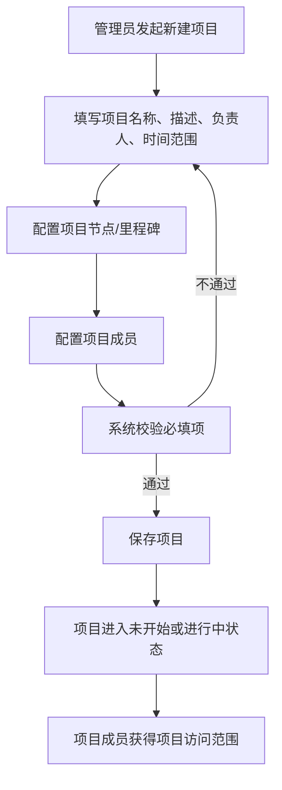
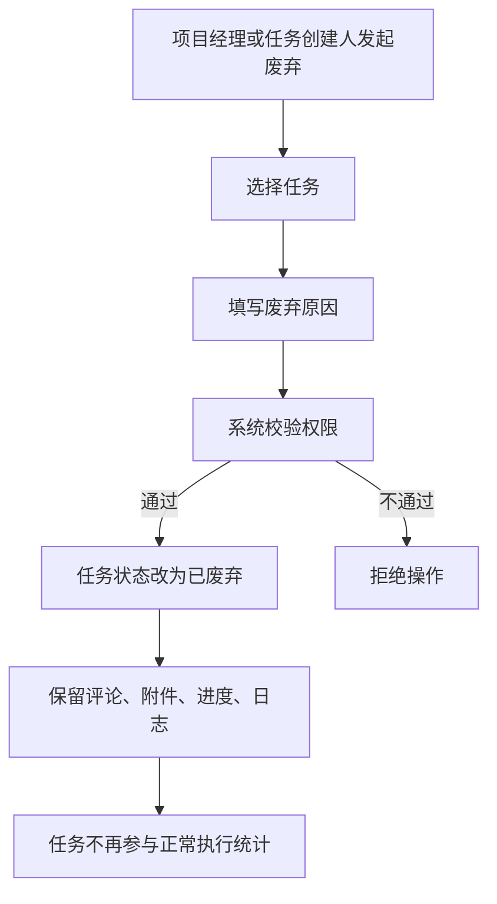
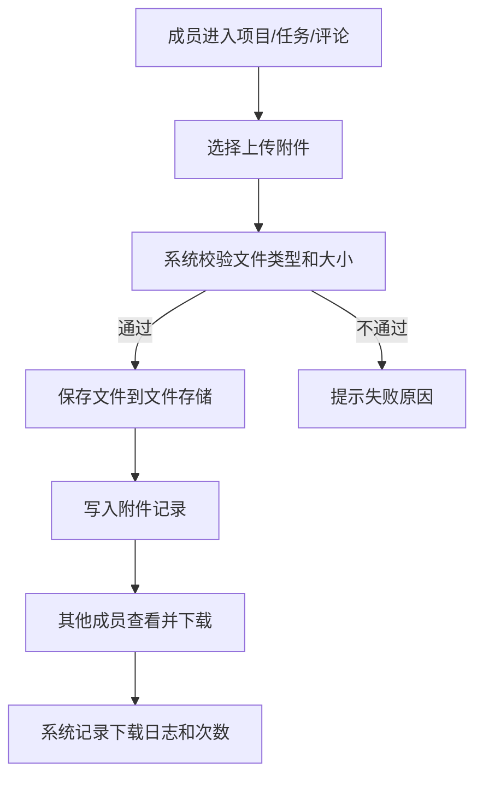

# 项目管理功能设计文档

## 1. 文档目标

本文档用于明确项目管理模块的业务边界、核心对象、关键规则、业务流程和技术实现候选方案，作为后续正式开发项目管理功能的依据。

本文档重点解决以下问题：

- 项目由谁创建，创建时需要录入哪些信息
- 项目创建后，成员如何围绕项目持续协作
- 任务如何创建、分配、更新进度、提醒、评论、上传附件、@关注
- 为什么任务不能删除，只能废弃
- 哪些操作必须保留追踪记录
- 后续开发时采用什么技术方案更合适

## 2. 模块定位

项目管理模块是整个平台的核心业务枢纽，负责把“项目目标、节点计划、任务执行、进度反馈、协作沟通、过程留痕”统一沉淀在一个地方。

本模块不是审批系统，不强调审批链；更强调：

- 项目透明化
- 过程可追踪
- 责任明确
- 信息沉淀
- 协作顺畅

## 3. 设计原则

- 管理口径统一：项目、节点、任务、评论、附件、提醒都挂在项目上下文内
- 过程可追溯：关键对象默认不物理删除，优先采用状态变更和归档
- 操作尽量轻量：减少复杂审批，强调直接协作
- 数据可沉淀：附件、评论、进度、提醒、操作记录都要保留
- 权责清晰：管理员负责项目创建，成员负责项目内执行协作
- 面向后续扩展：当前先做基础项目协作，后面可扩展需求、迭代、缺陷、工时等模块

## 4. 角色与权限范围

### 4.1 角色划分

- 平台管理员：创建项目、维护项目基础信息、管理项目成员范围
- 项目经理：维护项目计划、节点、任务结构、任务分配、风险跟踪
- 项目成员：创建任务、更新进度、评论、上传下载附件、提醒他人、关注任务
- 观察者：查看项目进展、评论、附件和动态，不负责执行

### 4.2 权限原则

- 新建项目：仅管理员可操作
- 编辑项目基础信息：管理员、被授权的项目经理可操作
- 新建任务：项目成员可操作
- 编辑任务：任务负责人、任务创建人、项目经理可操作
- 删除任务：不允许物理删除
- 废弃任务：项目经理、任务创建人可操作，保留全部历史记录
- 评论、@提醒、上传附件：项目成员可操作
- 下载附件：项目可见范围内成员可操作

## 5. 核心业务对象

### 5.1 项目

项目是最高层的业务容器，包含整个交付目标和协作范围。

建议字段：

- 项目编号
- 项目名称
- 项目描述
- 项目类型
- 项目状态：未开始、进行中、已暂停、已完成、已归档
- 项目优先级
- 项目负责人
- 创建人
- 计划开始时间
- 计划结束时间
- 实际开始时间
- 实际结束时间
- 项目标签
- 项目目标
- 项目备注

### 5.2 项目节点

项目节点用于描述项目阶段性目标和时间计划，可理解为里程碑或阶段节点。

建议字段：

- 节点名称
- 节点描述
- 节点顺序
- 节点负责人
- 节点状态：未开始、进行中、已完成、已延期、已取消
- 计划开始时间
- 计划结束时间
- 实际开始时间
- 实际结束时间
- 节点输出物说明

### 5.3 任务

任务是项目执行的核心对象，用于承载实际工作。

建议支持两级或三级结构：

- 一级：主任务
- 二级：子任务
- 三级：执行项或技术线子任务

建议字段：

- 任务编号
- 所属项目
- 所属节点
- 父任务 ID
- 任务标题
- 任务描述
- 任务类型：开发、测试、设计、联调、运维、文档、其他
- 任务状态：待开始、进行中、已阻塞、已完成、已废弃
- 优先级：低、中、高、紧急
- 创建人
- 负责人
- 协作人列表
- 关注人列表
- 计划开始时间
- 计划结束时间
- 实际开始时间
- 实际结束时间
- 预计工时
- 实际工时
- 当前进度百分比
- 废弃原因
- 完成标准
- 排序号

### 5.4 评论

评论用于围绕项目、节点、任务进行协作沟通。

建议字段：

- 评论对象类型：项目、节点、任务
- 评论对象 ID
- 评论内容
- 评论人
- 是否包含 @用户
- 被 @用户列表
- 附件列表
- 创建时间
- 编辑时间

### 5.5 附件

附件用于沉淀设计稿、截图、文档、日志、交付物等素材。

建议字段：

- 所属对象类型：项目、节点、任务、评论
- 所属对象 ID
- 文件原名
- 文件存储名
- 文件类型
- 文件大小
- 上传人
- 上传时间
- 下载次数
- 备注说明

### 5.6 提醒与通知

提醒用于拉起协作，不是审批消息。

提醒来源包括：

- 任务分配
- 任务即将到期
- 任务逾期
- 评论中 @用户
- 附件更新
- 进度变更
- 任务状态变更

## 6. 关键业务规则

### 6.1 项目创建规则

- 只有管理员可以新建项目
- 新建项目时必须填写项目名称、描述、负责人、计划时间
- 项目至少要配置一个节点，允许后续继续新增节点
- 项目创建完成后，才允许成员进入项目内创建任务

### 6.2 任务创建规则

- 项目成员都可以创建任务
- 任务必须属于某个项目
- 任务可选关联某个节点
- 任务允许设置父子层级
- 任务创建时建议指定负责人，若未指定则默认为创建人

### 6.3 任务删除与废弃规则

- 平台不允许物理删除任务
- 已创建任务只允许变更状态为“已废弃”
- 任务被废弃时必须填写废弃原因
- 废弃任务默认不参与正常进度统计，但必须可追溯、可查询、可恢复
- 任务下已有评论、附件、进度记录时更不能删除，只能废弃

这样设计的原因是：

- 保留完整执行链路
- 避免人为删除导致追踪断裂
- 方便复盘和审计
- 保留历史工作量与决策依据

### 6.4 进度更新规则

- 负责人可以更新任务进度百分比
- 可填写本次进展说明
- 可记录阻塞原因和需要协助事项
- 当任务状态为已完成时，进度自动为 100%
- 当任务状态为待开始时，进度应为 0%
- 项目整体进度可按任务权重、节点完成度或任务数量自动汇总

### 6.5 评论与 @规则

- 项目成员可对项目、节点、任务发表评论
- 评论中支持 @其他用户
- 被 @用户收到系统提醒
- 评论内容不支持硬删除，若需要处理则标记为已撤回或已隐藏
- 评论属于项目过程记录的一部分

### 6.6 附件规则

- 附件可上传到项目、节点、任务、评论
- 附件需保留上传人和上传时间
- 支持下载和下载次数统计
- 附件不建议直接覆盖，应保留版本或新增上传记录
- 若后续需要可扩展预览能力，首期先支持图片和常见文档下载

### 6.7 提醒规则

- 任务指派给负责人时自动提醒
- 临近截止时间自动提醒
- 逾期自动提醒负责人和项目经理
- 评论 @用户时自动提醒
- 任务状态变更为阻塞时提醒项目经理

### 6.8 操作留痕规则

以下操作必须记录日志：

- 新建项目
- 编辑项目基础信息
- 新增、编辑、废弃任务
- 任务负责人变更
- 任务状态变更
- 任务进度变更
- 上传、下载附件
- 评论和 @提醒

## 7. 页面与功能拆分建议

### 7.1 项目列表页

主要功能：

- 查看我可见的项目
- 筛选项目状态、负责人、时间范围
- 管理员新建项目
- 进入项目详情

### 7.2 新建项目页

主要功能：

- 填写项目基础信息
- 设置项目节点
- 指定项目负责人
- 指定首批成员

### 7.3 项目详情页

主要功能：

- 查看项目概览
- 查看节点进度
- 查看任务统计
- 查看最近动态
- 查看附件、评论、风险提示

### 7.4 节点管理页

主要功能：

- 新增节点
- 调整节点顺序
- 维护节点状态和时间计划
- 查看节点下任务

### 7.5 任务列表/看板页

主要功能：

- 按状态查看任务
- 按节点、负责人、优先级筛选
- 创建主任务和子任务
- 批量调整负责人或状态
- 快速查看是否逾期、是否阻塞、是否有附件和评论

### 7.6 任务详情页

主要功能：

- 编辑任务基础信息
- 填写进度和进展说明
- 发表评论
- @成员
- 上传下载附件
- 查看历史操作记录
- 废弃任务

### 7.7 我的待办页

主要功能：

- 查看分配给我的任务
- 查看被 @提醒
- 查看即将到期和逾期任务

## 8. 业务流程设计

### 8.1 项目创建主流程



### 8.2 项目内任务协作流程

```mermaid
flowchart TD
    A[项目成员进入项目] --> B[创建任务或子任务]
    B --> C[选择所属节点/父任务]
    C --> D[指定负责人和协作人]
    D --> E[填写计划时间和描述]
    E --> F[保存任务]
    F --> G[系统通知负责人]
    G --> H[负责人开始执行]
    H --> I[更新进度/状态]
    I --> J[评论、@成员、上传附件]
    J --> K{任务是否完成}
    K -->|否| I
    K -->|是| L[标记已完成]
```

### 8.3 任务废弃流程



### 8.4 评论与 @提醒流程

```mermaid
flowchart TD
    A[成员在任务中发表评论] --> B[输入评论内容]
    B --> C{是否@他人}
    C -->|否| D[保存评论]
    C -->|是| E[解析@用户]
    E --> D
    D --> F[写入评论记录]
    F --> G[生成提醒消息]
    G --> H[@用户在待办/消息中心查看]
```

### 8.5 附件上传下载流程



### 8.6 项目跟踪总流程

```mermaid
flowchart LR
    A[管理员创建项目] --> B[配置节点与成员]
    B --> C[成员创建任务]
    C --> D[负责人执行任务]
    D --> E[更新进度与评论]
    E --> F[上传附件与素材]
    F --> G[@协作成员处理问题]
    G --> H[任务完成或废弃]
    H --> I[节点完成度汇总]
    I --> J[项目整体进度跟踪]
```

## 9. 非功能要求建议

### 9.1 可追踪性

- 所有关键变更保留日志
- 所有对象保留创建人和更新时间
- 任务不能直接删除

### 9.2 易用性

- 常用操作尽量在项目详情和任务详情内完成
- 评论、附件、提醒尽量低门槛
- 支持按项目、节点、负责人快速筛选

### 9.3 扩展性

- 后续可扩展需求、缺陷、工时、版本发布
- 任务结构应兼容未来与需求或缺陷关联
- 通知机制后续可扩展站内信、邮件、企业微信

## 10. 技术实现方案候选

下面给出 3 套更适合当前项目管理模块的技术实现方案，供你选择。

### 10.1 方案 A：轻量直连型

技术思路：

- 后端：FastAPI + SQLAlchemy + SQLite
- 文件：本地文件目录存储附件
- 通知：先用站内消息表
- 前端：Vue3 + Element Plus，常规列表页 + 详情抽屉/弹窗

优点：

- 开发快
- 结构简单
- 适合当前功能先落地
- 本地调试成本低

缺点：

- 文件服务能力一般
- 并发和扩展性有限
- 后续改造为生产部署时需要补更多基础设施

适用场景：

- 当前阶段快速完成项目、任务、评论、附件、提醒的第一版

### 10.2 方案 B：标准业务型

技术思路：

- 后端：FastAPI + SQLAlchemy + SQLite 开发 / PostgreSQL 生产
- 文件：统一附件服务接口，本地存储开发、MinIO 或对象存储生产
- 通知：站内消息表 + Redis 可选缓存
- 前端：Vue3 + Element Plus，项目详情、任务详情、消息中心拆分页面
- 审计：独立操作日志表

优点：

- 开发期和生产期衔接自然
- 数据模型更规范
- 附件、日志、提醒都可持续扩展
- 比较适合项目管理平台的长期演进

缺点：

- 开发量比方案 A 大一些
- 需要一开始就设计更清晰的数据模型

适用场景：

- 想先把功能做对，并且后续继续长期开发

### 10.3 方案 C：事件驱动增强型

技术思路：

- 后端：FastAPI + PostgreSQL
- 文件：MinIO / 对象存储
- 通知：Redis + 异步任务队列
- 审计：事件表或消息总线，所有状态变更事件化
- 前端：Vue3 + 更强的实时消息能力

优点：

- 扩展性最好
- 适合复杂提醒、实时协作和大量操作留痕
- 后续接入消息推送、报表分析更方便

缺点：

- 实现复杂度高
- 当前阶段明显偏重
- 对部署和运维要求更高

适用场景：

- 目标是直接按较成熟的企业级协作平台路线推进

## 11. 方案对比

| 对比项 | 方案 A | 方案 B | 方案 C |
| --- | --- | --- | --- |
| 开发速度 | 高 | 中 | 低 |
| 上手成本 | 低 | 中 | 高 |
| 数据模型规范性 | 中 | 高 | 高 |
| 附件与日志扩展性 | 中 | 高 | 高 |
| 实时提醒能力 | 低 | 中 | 高 |
| 适合当前阶段 | 高 | 很高 | 低 |
| 后续升级平滑度 | 中 | 很高 | 高 |

## 12. 推荐意见

结合当前项目实际情况，建议优先选择方案 B。

原因如下：

- 你已经在登录和权限部分采用了“开发期轻量、结构上可升级”的路线
- 项目管理模块天然会涉及更多核心数据，建议从一开始就把任务、评论、附件、日志结构设计规范一点
- 方案 B 可以继续保持开发阶段用 SQLite，后续切换 PostgreSQL 也比较顺
- 方案 B 不会像方案 C 那样过重，但比方案 A 更适合长期演进

## 13. 选择后的下一步开发建议

当你确认技术方案后，建议按以下顺序进入开发：

1. 先设计项目、节点、任务、评论、附件、提醒、操作日志的数据表
2. 实现项目管理模块后端 API
3. 完成项目列表、项目详情、任务列表、任务详情页面
4. 最后接入附件上传下载和消息提醒

## 14. 实施对齐说明（2026-03-20）

以下能力已完成并与本文档设计保持一致：

- 项目创建仅管理员可操作
- 任务不支持物理删除，仅支持废弃
- 评论支持 `@` 提醒并进入通知中心
- 通知支持已读/全部已读
- 附件支持上传与下载
- 任务支持主任务与子任务关系（可在任务详情新增子任务）
- 项目与任务支持标签
- 项目支持按关键词、状态、负责人、标签筛选
- 任务支持按关键词、状态、负责人、标签筛选
- 支持关注项目与关注任务，并提供对应列表

界面与交互实现对齐：

- 左侧一级菜单宽度 200px，可收起/展开
- 顶部导航高度 60px
- 左侧导航与顶部导航固定，不随内容滚动消失
- 任务列表“查看”采用右侧抽屉，宽度 700px
- 项目管理二级菜单已实现：
  - 项目清单
  - 任务清单
  - 关注项目
  - 关注任务
- 关键信息、统计指标、板块标题使用 emoji 装饰
- 板块间距收紧为 8px，内容区更紧凑

待继续完善：

- 项目节点的独立维护页面（增删改排）
- 任务详情抽屉的更细粒度编辑体验
- 附件本体从本地文件迁移到 MinIO
