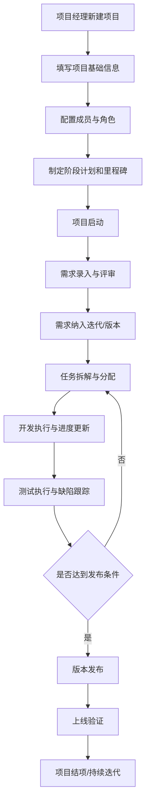
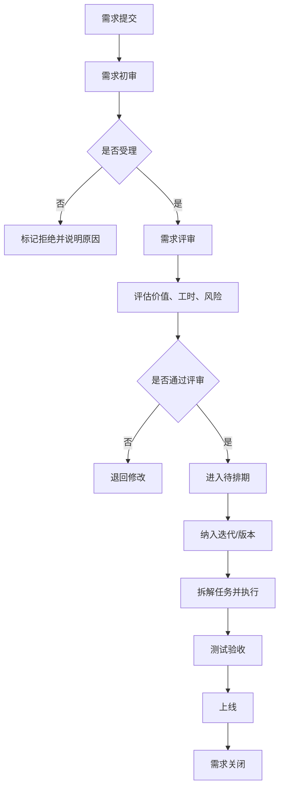
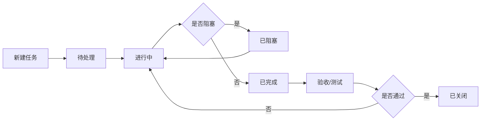
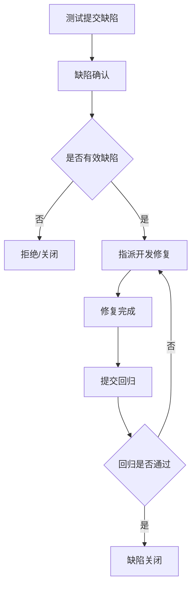
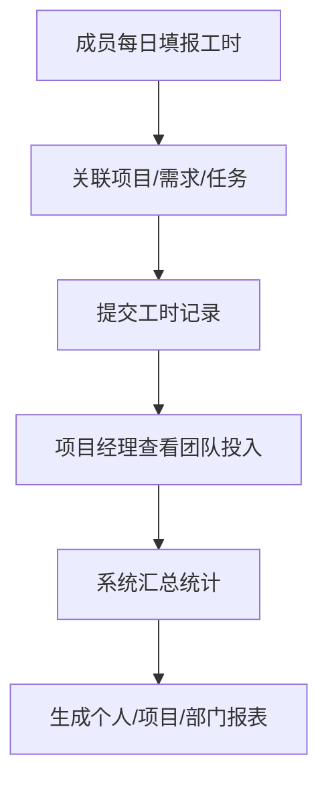
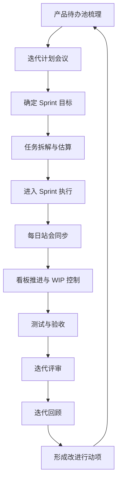

# 项目管理平台需求文档

## 1. 文档说明

- 文档名称：项目管理平台需求文档
- 适用阶段：产品规划 / 原型设计 / 技术方案设计 / 后续开发实施
- 使用对象：产品经理、项目经理、开发、测试、运维、管理层
- 技术方向：
  - 后端：Python + FastAPI
  - 前端：Vue3
- 对标产品：Jira、Worktile
- 平台定位：面向公司内部的项目协同与全过程跟踪平台，覆盖项目立项、需求管理、任务拆解、开发执行、测试验证、发布上线、统计分析等核心环节

## 2. 项目背景与目标

### 2.1 背景

当前公司内部项目管理常见问题包括：

- 项目状态分散在聊天、Excel、邮件中，信息不统一
- 需求、开发、测试之间流转缺少标准化流程
- 项目进度不透明，延期风险发现较晚
- 缺少统一的工时、缺陷、交付、效率统计
- 管理层难以从多个项目中快速查看整体投入和风险

因此需要建设一套内部项目管理平台，用于统一账号、统一流程、统一数据、统一看板。

### 2.2 建设目标

- 建立统一的用户账号、组织、角色和权限体系
- 支持项目从创建到结项的全生命周期管理
- 支持需求、任务、缺陷、测试、版本发布等业务协同
- 提供项目进度、工时、风险、质量、交付等统计分析能力
- 强化项目过程晾晒、目标对齐、信息透明和跨角色协同
- 为后续沉淀项目资产、过程标准化和管理决策提供数据基础

## 3. 平台定位与范围

### 3.1 平台定位

该平台主要服务于公司内部研发类项目管理，既支持项目经理做计划与推进，也支持开发、测试、产品、管理者进行协同。

### 3.2 业务范围

建议一期覆盖以下核心能力：

- 组织与账号管理
- 项目管理
- 需求管理
- 任务管理
- 缺陷管理
- 测试管理
- 工时与日报周报
- 文档协作与知识沉淀
- 敏捷例会与回顾改进
- 风险与问题管理
- 版本与发布管理
- 看板与统计报表
- 通知与消息中心
- 操作记录与基础配置

### 3.3 不在一期重点范围的能力

以下功能建议作为二期或后续规划：

- 合同、采购、预算报销等经营管理能力
- 客户门户、外部客户协同
- 代码托管替代能力
- 全量自动化测试平台
- AI 智能项目预测、智能排期、智能需求拆解

## 4. 用户角色设计

建议平台支持“组织角色 + 项目参与范围”的轻量模型，核心目标是方便协同和信息透明，而不是通过复杂权限限制功能使用。

### 4.1 组织级角色

- 超级管理员：负责平台初始化、组织架构、系统配置
- 系统管理员：负责账号、部门、角色、字典、参数配置
- 管理层：查看项目总体进展、资源投入、风险、质量报表
- 部门负责人：查看本部门项目、成员工作负载与绩效相关数据

### 4.2 项目级角色

- 项目经理：创建项目、制定计划、分配成员、推进执行、跟踪风险
- 产品经理 / 需求提出人：提交和维护需求，参与评审和验收
- 开发负责人：任务拆解、开发排期、技术风险识别
- 开发人员：领取任务、更新进度、提交工时、关联代码/版本
- 测试负责人：制定测试计划、安排测试任务、跟踪质量
- 测试人员：执行测试、提交缺陷、回归验证
- 运维 / 发布人员：执行发布、记录上线结果、处理发布异常
- 观察者 / 干系人：查看项目进展、过程信息和关键数据

### 4.3 使用范围原则

- 功能开放：在权限范围内，项目相关功能默认可使用，不做复杂审批型功能限制
- 范围控制：主要控制用户可查看和参与哪些项目、团队、部门的数据
- 透明协同：项目成员默认可查看项目中的需求、任务、缺陷、进度、文档和统计信息
- 轻量管理：保留必要的组织管理和系统配置能力，不引入繁琐的审批链路

## 5. 核心业务场景

### 5.1 典型场景

- 项目经理创建项目，配置周期、成员、里程碑和看板流程
- 产品经理提交需求，组织评审并确认优先级
- 开发负责人将需求拆解为迭代和任务，分配给开发成员
- 开发人员更新任务状态、记录工时、提交联调说明
- 测试人员根据需求和任务进行测试，发现问题后登记缺陷
- 项目经理跟踪需求完成率、任务燃尽、延期项和风险项
- 管理层查看各项目整体健康度、交付情况、资源投入
- 团队围绕 OKR、项目目标、迭代目标进行对齐和过程跟踪
- 干系人随时查看项目动态、问题、风险和关键交付信息

### 5.2 管理目标

- 看得见：项目状态透明
- 管得住：流程规范可控
- 晒得出：项目过程持续可见
- 对得齐：团队目标与项目目标一致
- 查得到：过程可追溯
- 统得出：数据可统计
- 能复盘：项目经验可沉淀

## 6. 功能架构设计

## 6.1 功能总览

建议平台采用如下一级功能模块：

1. 登录与个人工作台
2. 组织与范围管理
3. 项目管理
4. 需求管理
5. 迭代与任务管理
6. 缺陷与测试管理
7. 工时、日报与资源管理
8. 风险、问题与变更管理
9. 版本与发布管理
10. 统计分析与可视化看板
11. 消息通知与待办中心
12. 文档协作与知识库
13. 系统设置与操作记录

## 7. 详细功能需求

### 7.1 登录与个人工作台

#### 7.1.1 登录认证

- 用户名密码登录
- 图形验证码或短信/邮箱验证码
- 支持记住登录状态
- 支持密码修改、找回、重置
- 支持账号启用、禁用
- 支持单点登录预留能力

#### 7.1.2 个人工作台

- 今日待办
- 我参与的项目
- 我负责的需求 / 任务 / 缺陷
- 我的工时填报情况
- 即将到期事项提醒
- 最新消息通知
- 个人效率概览
- 最近访问项目 / 文档 / 看板
- 快速新建需求、任务、缺陷
- 全局搜索入口

### 7.2 组织与范围管理

#### 7.2.1 组织架构

- 部门管理
- 岗位管理
- 用户管理
- 团队/项目组管理

#### 7.2.2 角色与范围配置

- 角色管理
- 项目成员范围配置
- 部门数据范围配置
- 常用角色模板
- 工作台可见范围配置

#### 7.2.3 用户信息

- 基础资料维护
- 所属部门、岗位、直属上级
- 技能标签
- 在岗状态
- 参与项目记录

### 7.3 项目管理

#### 7.3.1 项目立项

- 新建项目
- 项目编码自动生成
- 选择项目类型
- 填写项目名称、目标、背景、优先级
- 设定项目起止时间
- 选择项目经理
- 配置项目成员及角色
- 设置项目状态

#### 7.3.2 项目基础信息

- 项目简介
- 项目目标与交付物
- 关联业务线 / 部门
- 预算工时或预估人天
- 项目标签
- 项目附件

#### 7.3.3 项目计划管理

- 项目阶段划分
- 里程碑管理
- 计划开始/结束时间
- 里程碑负责人
- 里程碑完成标准
- 延期说明

#### 7.3.4 项目成员管理

- 成员新增、移除
- 成员角色调整
- 成员工作量查看
- 成员按项目范围参与协同

#### 7.3.5 项目状态跟踪

- 未开始
- 进行中
- 暂停
- 风险中
- 已完成
- 已关闭

#### 7.3.6 项目归档与结项

- 结项登记
- 项目总结
- 经验复盘
- 文档归档
- 历史数据归档保存

### 7.4 需求管理

#### 7.4.1 需求录入

- 新建需求
- 需求编号自动生成
- 需求标题、描述、来源、提出人
- 业务价值说明
- 优先级
- 紧急程度
- 预期上线时间
- 附件上传

#### 7.4.2 需求分类

- 新功能
- 功能优化
- 缺陷修复
- 技术改造
- 合规/安全需求

#### 7.4.3 产品待办池（Backlog）

- 建立项目级需求池
- 支持拖拽调整优先级
- 支持按业务线、版本、标签筛选
- 支持估算故事点 / 人天
- 支持批量纳入迭代
- 支持区分已承诺与未承诺事项

#### 7.4.4 需求生命周期

- 草稿
- 待评审
- 已评审
- 待排期
- 开发中
- 测试中
- 已上线
- 已关闭
- 已拒绝

#### 7.4.5 需求评审

- 评审会议记录
- 评审结论
- 工时预估
- 技术风险评估
- 测试影响评估
- 是否进入版本/迭代

#### 7.4.6 需求拆解与关联

- 需求拆解为任务
- 需求关联迭代
- 需求关联测试用例
- 需求关联缺陷
- 需求关联版本

#### 7.4.7 需求变更控制

- 需求变更申请
- 变更前后对比
- 影响范围评估
- 重新评审
- 变更记录留痕

### 7.5 迭代与任务管理

#### 7.5.1 迭代管理

- 创建迭代
- 设定迭代目标
- 设定周期
- 选择纳入需求
- 查看迭代燃尽情况
- 关闭迭代

#### 7.5.2 迭代计划与敏捷例会

- Sprint 目标设定
- Sprint 周期配置
- 迭代计划会议记录
- 每日站会记录
- 迭代评审记录
- 迭代回顾记录
- 改进行动项跟踪

#### 7.5.3 任务管理

- 新建任务 / 子任务
- 任务标题、描述、优先级、负责人、计划时间
- 任务指派、转派、关注
- 任务标签
- 任务依赖关系
- 任务附件
- 评论与讨论

#### 7.5.4 任务状态流转

- 待处理
- 进行中
- 已完成
- 已验收
- 已关闭
- 已阻塞

#### 7.5.5 看板视图

- 支持按项目查看看板
- 支持按迭代查看看板
- 支持泳道展示
- 支持拖拽变更状态
- 支持按成员、优先级、标签筛选
- 支持自定义列和状态流
- 支持设置 WIP 限制
- 支持卡片字段定制展示
- 支持累计流图所需状态数据沉淀

#### 7.5.6 甘特图 / 时间线 / 日历视图

- 查看项目整体任务排期
- 查看里程碑与关键路径
- 支持延期高亮
- 支持依赖关系展示
- 支持按周/月查看任务日历
- 支持查看成员近期排期冲突

### 7.6 缺陷与测试管理

#### 7.6.1 测试计划

- 创建测试计划
- 设定测试范围
- 设定测试轮次
- 指定测试负责人
- 设定测试起止时间

#### 7.6.2 测试用例管理

- 测试用例编写
- 用例分类
- 前置条件
- 执行步骤
- 预期结果
- 用例版本管理

#### 7.6.3 测试执行

- 执行结果登记
- 通过 / 失败 / 阻塞
- 执行人、执行时间记录
- 测试报告生成

#### 7.6.4 缺陷管理

- 新建缺陷
- 缺陷编号自动生成
- 严重程度
- 优先级
- 发现版本
- 复现步骤
- 期望结果与实际结果
- 指派修复人
- 关联需求、任务、测试用例

#### 7.6.5 缺陷状态流转

- 新建
- 已确认
- 修复中
- 待回归
- 已关闭
- 已拒绝
- 延后处理

#### 7.6.6 质量分析

- 缺陷趋势统计
- 缺陷分布统计
- 严重缺陷统计
- 缺陷关闭时长统计
- 测试通过率

### 7.7 工时、日报与资源管理

#### 7.7.1 工时填报

- 按项目填报工时
- 按需求/任务填报工时
- 支持每日填报
- 支持补录
- 支持按周/月统计汇总

#### 7.7.2 日报周报

- 自动汇总当天完成事项
- 手动补充问题与计划
- 生成个人日报 / 周报
- 项目经理查看团队汇总
- 站会摘要自动汇总
- 迭代结束自动汇总完成/未完成事项

#### 7.7.3 资源负载

- 查看成员当前项目分配
- 查看成员任务负载
- 查看部门资源占用
- 识别超负荷人员

### 7.8 风险、问题与变更管理

#### 7.8.1 风险管理

- 登记项目风险
- 风险等级
- 风险描述
- 影响分析
- 应对措施
- 跟踪状态

#### 7.8.2 问题管理

- 登记项目问题
- 问题责任人
- 处理期限
- 处理进展
- 问题关闭确认

#### 7.8.3 变更管理

- 项目范围变更
- 排期变更
- 人员变更
- 版本变更
- 变更影响记录

### 7.9 OKR 与目标对齐

#### 7.9.1 OKR 管理

- 支持公司 / 部门 / 项目级 OKR 录入
- 支持 Objective 与 Key Result 结构化管理
- 支持 KR 进度更新
- 支持 OKR 周期管理
- 支持负责人和协作人

#### 7.9.2 目标关联

- 项目关联 OKR
- 需求关联目标
- 迭代目标关联 KR
- 支持查看目标到执行项的映射关系

#### 7.9.3 目标透明化

- 支持目标公开展示
- 支持目标进展趋势查看
- 支持按部门 / 项目查看目标达成情况
- 支持目标风险与阻塞项晾晒

### 7.10 版本与发布管理

#### 7.9.1 版本管理

- 创建版本
- 版本编号
- 版本目标
- 关联需求 / 缺陷
- 版本状态
- 计划发布时间

#### 7.9.2 发布管理

- 发布申请
- 发布检查项
- 发布窗口
- 发布执行记录
- 回滚预案
- 发布结果记录

#### 7.9.3 发布后追踪

- 上线验证结果
- 线上问题登记
- 发布总结

### 7.11 统计分析与可视化看板

#### 7.10.1 项目总览看板

- 项目数量统计
- 项目状态分布
- 延期项目统计
- 高风险项目统计
- 项目完成率
- 项目动态时间线
- 项目过程晾晒面板

#### 7.10.2 需求统计

- 需求新增趋势
- 需求完成趋势
- 需求类型分布
- 需求延期统计

#### 7.10.3 任务统计

- 任务完成率
- 任务延期率
- 任务燃尽图
- 成员任务负载图
- 累积流图
- 吞吐量统计
- 平均流转周期

#### 7.10.4 缺陷质量统计

- 缺陷新增/关闭趋势
- 缺陷严重级别分布
- 缺陷解决时长
- 缺陷重开率

#### 7.10.5 工时统计

- 个人工时统计
- 项目工时投入
- 部门工时分布
- 计划工时与实际工时对比

#### 7.10.6 管理层视图

- 跨项目对比
- 项目健康度评分
- 资源利用率
- 交付达成率
- 迭代速度趋势
- 瓶颈环节分析
- OKR 达成趋势
- 项目透明度看板

### 7.12 消息通知与待办中心

- 待我处理
- 抄送我的
- 系统公告
- 项目动态消息
- 状态变更通知
- 即将超期提醒
- 支持站内信
- 预留邮件 / 企业微信 / 钉钉通知能力
- 支持任务评论与 @ 提醒
- 支持站会、评审、回顾会议提醒
- 支持项目动态订阅
- 支持关键里程碑广播

### 7.13 文档协作与知识库

#### 7.12.1 项目文档

- 项目文档目录管理
- 在线预览
- 富文本编辑预留
- 文档版本记录
- 文档评论与讨论
- 文档范围可见设置

#### 7.12.2 知识沉淀

- 需求说明文档
- 会议纪要
- 测试报告
- 发布说明
- 项目复盘文档
- 常见问题库

#### 7.12.3 文档关联能力

- 文档关联项目、需求、任务、缺陷、版本
- 支持从任务详情快速打开相关文档
- 支持文档被引用关系展示

### 7.14 系统设置与操作记录

#### 7.14.1 基础配置

- 字典配置
- 流程状态配置
- 优先级配置
- 项目类型配置
- 通知模板配置
- 自定义字段配置
- 看板列配置
- WIP 规则配置

#### 7.14.2 操作记录

- 登录日志
- 操作日志
- 数据变更日志
- 导出日志

## 8. 关键业务流程设计

### 8.1 项目立项与执行流程

### 8.2 需求管理流程

### 8.3 任务执行流程

### 8.4 缺陷处理流程

### 8.5 工时填报与统计流程

### 8.6 敏捷迭代闭环流程

## 9. 数据对象建议

平台核心数据对象建议包括：

- 用户
- 部门
- 角色
- 项目
- 项目成员
- 里程碑
- 需求
- 迭代
- 任务
- 子任务
- 测试计划
- 测试用例
- 测试执行记录
- 缺陷
- 风险
- 问题
- 变更
- 版本
- 发布记录
- 工时记录
- OKR
- Key Result
- 站会记录
- 回顾记录
- 改进行动项
- 项目文档
- 消息通知
- 操作日志

## 10. 状态与字段标准化建议

为便于后续 FastAPI 和 Vue3 开发，建议从一开始统一以下内容：

- 统一编码规则：项目编号、需求编号、任务编号、缺陷编号、版本编号
- 统一状态机：每类对象有明确状态流转
- 统一优先级枚举：P0/P1/P2/P3 或 紧急/高/中/低
- 统一严重程度：致命/严重/一般/提示
- 统一时间字段：创建时间、更新时间、计划时间、实际完成时间
- 统一负责人字段：创建人、负责人、协作人
- 统一审计字段：创建人ID、更新人ID、逻辑删除标记

## 11. 非功能需求

### 11.1 性能要求

- 常规页面响应时间控制在 3 秒内
- 列表查询支持分页、筛选、排序
- 支持大多数常规并发办公场景

### 11.2 安全要求

- 密码加密存储
- 登录失败次数限制
- 范围校验与接口访问控制
- 关键操作日志留存
- 文件上传安全校验

### 11.3 易用性要求

- 页面结构清晰，尽量少层级跳转
- 工作台突出待办和异常提醒
- 支持列表筛选、快捷搜索、保存筛选条件

### 11.4 可维护性要求

- 前后端分离
- API 命名规范
- 模块化设计
- 预留工作流、消息、第三方集成扩展点

## 12. 技术实现建议

### 12.1 后端建议

基于 FastAPI 建议采用模块化领域划分：

- auth：认证与授权
- user：用户、部门、角色
- project：项目、成员、里程碑
- requirement：需求管理
- sprint：迭代管理
- task：任务管理
- test：测试计划、用例、执行
- bug：缺陷管理
- release：版本与发布
- timesheet：工时与日报
- report：统计分析
- notification：消息通知
- system：字典、配置、日志

### 12.2 前端建议

Vue3 建议采用后台管理系统结构：

- 登录页
- 工作台首页
- 项目中心
- 需求中心
- 任务看板
- 测试与缺陷中心
- 报表中心
- 系统管理

### 12.3 范围控制建议

- 组织角色用于区分管理职责和默认视图
- 项目范围用于控制用户能参与和查看哪些项目数据
- 接口层与前端路由层统一做范围校验

## 13. 一期 MVP 建议

如果希望尽快落地，建议一期先做最核心闭环：

1. 账号登录、组织与范围管理
2. 项目创建、成员配置、里程碑管理
3. 需求池、需求录入、评审、状态流转
4. 任务管理、看板、WIP 控制、进度跟踪
5. Sprint 管理、每日站会、回顾记录
6. 缺陷管理、测试执行基础能力
7. 工时填报与基础日报
8. 项目总览、任务统计、缺陷统计
9. 通知提醒、评论 @ 和操作记录
10. 项目文档与会议纪要沉淀
11. OKR 基础管理与项目目标关联

这样可以先打通“项目 -> 需求 -> 任务 -> 测试/缺陷 -> 统计”的最小管理闭环。

## 14. 二期增强建议

- 自定义工作流
- 自定义字段
- 甘特图增强
- 发布流程自动化
- 与 Git、CI/CD、企业微信、钉钉集成
- 绩效与资源预测分析
- 项目复盘知识库

## 15. 成功标准建议

平台上线后可以通过以下指标衡量成效：

- 项目进度更新及时率
- 需求准时交付率
- 延期任务占比
- 缺陷关闭时长
- 团队工时填报完整率
- 管理层报表使用频率
- 项目过程数据完整率

## 16. 总结

该项目管理平台的核心目标不是单纯做一个任务列表工具，而是形成一套适合公司内部研发协同的统一管理系统。平台应重点覆盖项目、需求、任务、测试、缺陷、工时、统计等关键环节，形成从立项到交付再到复盘的完整闭环。

从产品规划角度看，建议优先建设透明协同、目标对齐、过程晾晒、状态流转和统计看板，这些能力是后续扩展自动化、智能化、集成化的基础。
